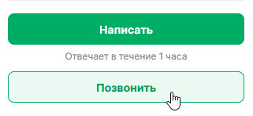
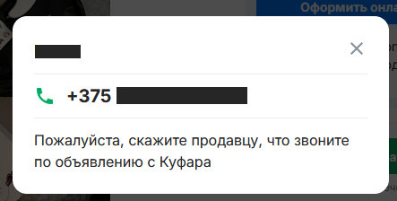
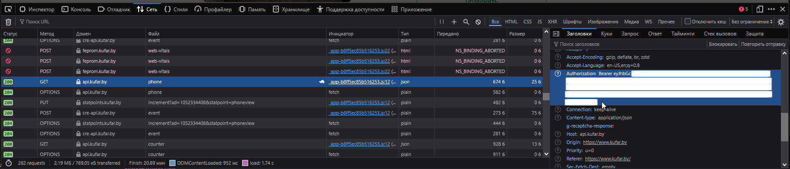

# Kufar.by Scraper

A Python script to scrape ads from the entry page of Kufar.by, extracting listings including titles, prices, regions, phone numbers, and detailed descriptions.

## Features

- Scrapes all listings from the main page
- Extracts title, price, region, and item ID for each listing
- Fetches phone numbers via Kufar's API
- Retrieves detailed descriptions and parameters from individual item pages
- Handles timeouts and errors... kinda

## Requirements

- Python 3.6+
- requests
- beautifulsoup4

## Installation

Clone this repository:
```bash
git clone https://github.com/Dadaskis/kufar_entry_page_parser
cd kufar_entry_page_parser
```

## Getting a Token

- You go to any store item where you'd be able to click the "Call"/"Позвонить" button.
<p align="center">
	
</p>

- You click that button.
- You'll see the following window:

<p align="center">
	
</p>

- Press F12 to open up web-developer toolkit.
- Go to "Networking".
- Find a request that states "GET api.kufar.by phone"
- Click it
- On the right, look for the headers, scroll to "Authorization" value
- Right click it, copy value

<p align="center">
	
</p>

- Congratulations, you now have a token.

## BE ADVISED

- Tokens will expire and you will need to repeat the process of getting a token.
- Eventually you might hit an error that says "ad phone view limit has been reached", in this case you might need a different account (a different token) OR wait for the next day. Sorry, there's no other way!